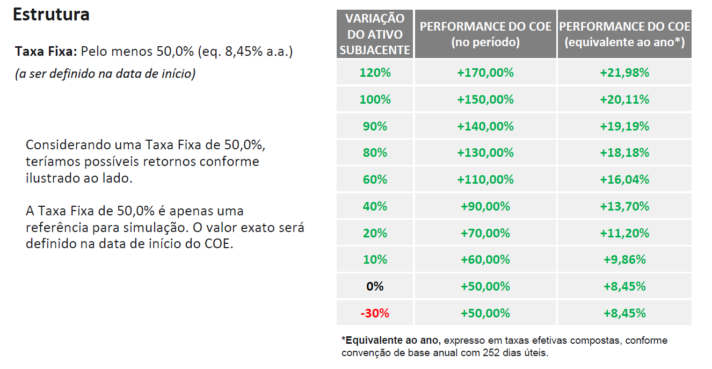
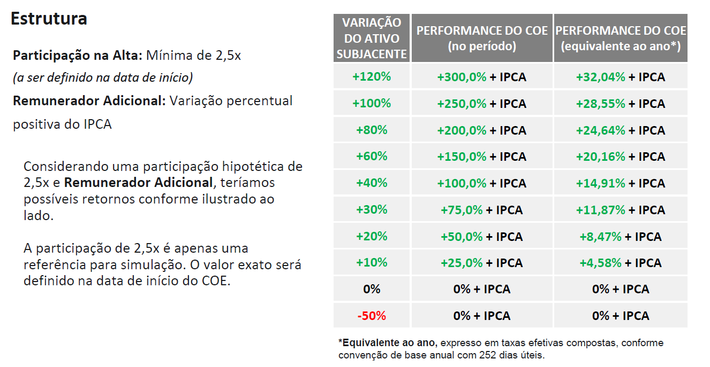

# Estudo de caso
### Realizando back tests para comparar o histórico de COE MAXP Prefixado x COE MAXP IPCA Alavancado

#### Descrição:

Durante minha atuação enquanto assessor de investimentos, houve uma ocasião na qual me vi em dúvida em relação a qual seria o melhor dentre dois produtos de investimento disponibilizados pela corretora naquela ocasião. Esta dúvida rendeu muita discussão entre meus colegas de profissão.

De um lado, o <b>COE XP MAXP Prefixado</b>, uma estrutura que garantia o uma remuneração de pelo menos 50% no período, além do rendimento do fundo atrelado ao produto <i>(MerQube XP Multi Asset 6 VT)</i>.

 

 

Do outro lado, o <b>COE XP MAXP + IPCA Alavancado</b>, uma estrutura que garantia que não haveria queda, e no caso de alta, entregava IPCA + 2,5 vezes o rendimento do fundo atrelado ao produto <i>(MerQube XP Multi Asset 6 VT).</i>

 

 

<b>Vale ressaltar que este estudo tem fins educacionais, e que este documento não é uma recomendação de investimento.</b> Primeiro, pois estes ativos dentro das condições estabelecidas já não se encontram mais disponíveis para aquisição. Segundo, pois cada cliente possui objetivos que podem ou não se enquadrar para os produtos aqui citados. Por fim, aqui estamos olhando para o passado, a fim de ter uma visão do histórico retroativo destes produtos de modo a melhor embasar uma decisão de investimento futuro tomado naquela época, não devendo ser o único meio para tal decisão, mas uma ferramenta adicional para este fim.

#### Links dos dados utilizados:

  - https://www.ibge.gov.br/estatisticas/economicas/precos-e-custos/9256-indice-nacional-de-precos-ao-consumidor-amplo.html?=&t=o-que-e
  - https://www.b3.com.br/pt_br/market-data-e-indices/indices/indices-de-segmentos-e-setoriais/serie-historica-do-di.htm
  - https://merqube.com/index/MQMAXP6